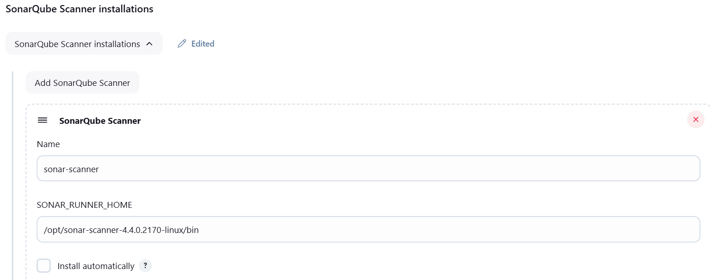
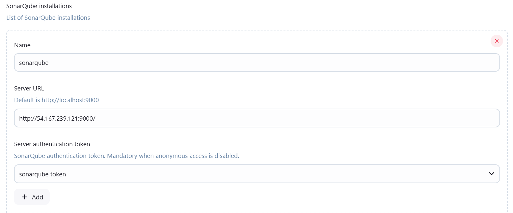
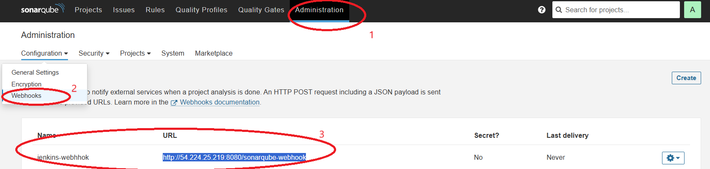

# springboot-with-jenkins-CICD

# Pre-Requisites:
- Java
- Jenkins
- Git
- Maven
- Sonar Scanner
- Sonarqube
- Nexus
- Docker
- Trivy

# Java17 Installation

```sh
yum install java-17-amazon-corretto -y
```

# Jenkins Setup

```
wget -O /etc/yum.repos.d/jenkins.repo \
    https://pkg.jenkins.io/redhat-stable/jenkins.repo
rpm --import https://pkg.jenkins.io/redhat-stable/jenkins.io-2023.key
yum install fontconfig java-17-amazon-corretto -y
yum install jenkins -y
service jenkins start

# Enable port: 8080 in security group and try to login to Jenkins
```

# GIT Installation

```sh
yum install git -y
```

# Maven Installation

```sh
yum install maven -y
```

## Sonar Scanner Installation

```sh
cd /opt
wget https://binaries.sonarsource.com/Distribution/sonar-scanner-cli/sonar-scanner-cli-4.4.0.2170-linux.zip
unzip sonar-scanner-cli-4.4.0.2170-linux.zip
```

Integrate Sonar scanner tool with in jenkins

Path: Manage Jenkins --> Tools



## Sonarqube Setup
Setting up sonarqube with postgres database using this [url](https://github.com/Naresh240/sonarqube-installation/blob/main/README.md)

SonarQube with Jenkins:

1. Add plugin: Manage Jenkins --> Plugins --> Available Plugins --> SonarQube Scanner
2. Add Sonarqube to Jenkins



3. Add Webhook under sonarqube



# Docker Installation

```sh
yum install docker -y
service docker start

## Note: Add jenkins user to Docker group and then restart

usermod -aG docker jenkins
```

# Nexus Setup

```sh
cd /opt
wget -O nexus.tar.gz https://download.sonatype.com/nexus/3/latest-unix.tar.gz
tar -xvf nexus.tar.gz

chown -R ec2-user:ec2-user nexus-3.76.1-01
chown -R ec2-user:ec2-user sonatype-work

vi /opt/nexus-3.76.1-01/bin/nexus.rc
------------------------------------
run_as_user="ec2-user"

## Enable port: 8081 in security group and access from UI
```

# Trivy Installation

```sh
curl -sfL https://raw.githubusercontent.com/aquasecurity/trivy/main/contrib/install.sh | sh -s -- -b /usr/local/bin v0.18.3
```
